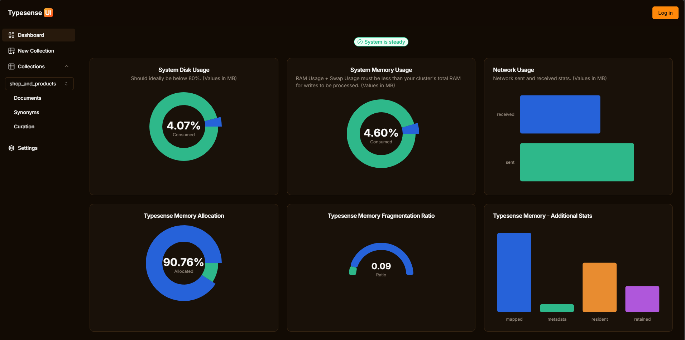
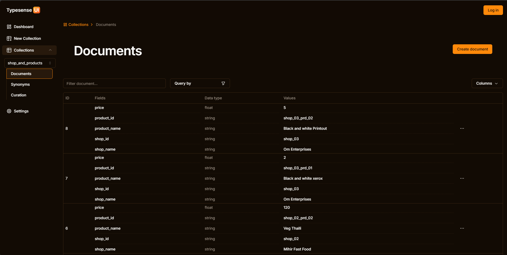
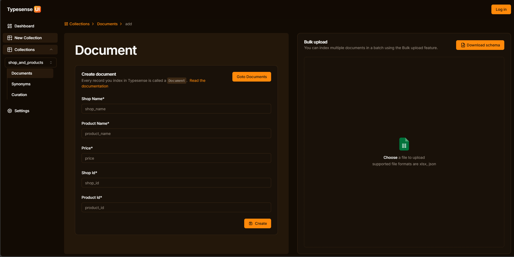
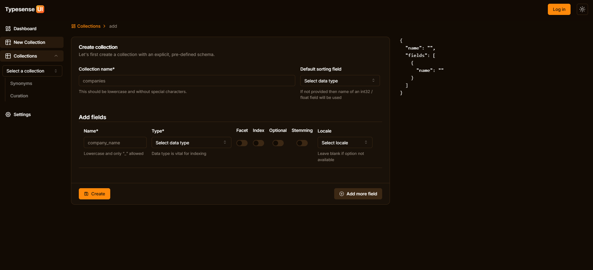
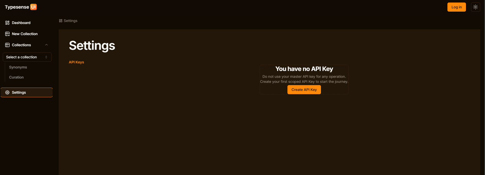
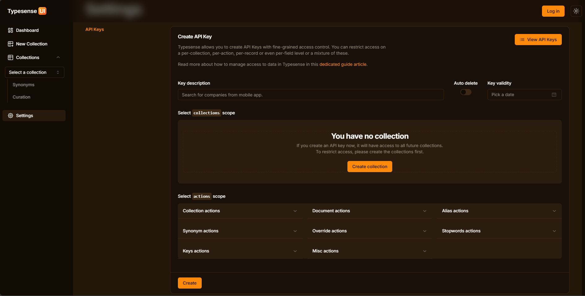

# Typesense UI (Alpha) [Typesense v26.0 Compatible](https://typesense.org/docs/26.0/api/)

An OpenSource user interface for Typesense self-hosted instance.

## All the available features are compatible with Typesense version 26.0

# Welcome to the typesense-ui wiki!

## Start Locally

### Start Typesense Server

#### Step 1: Clone the repo

```bash
git clone https://github.com/BadgerBloke/typesense-ui.git
```

#### Step 2: Goto Scripts

```bash
cd typesense-ui/scripts
```

#### Step 3: Create `.env` file

```bash
cp .env-example .env
```

you can change the values in `.env`

#### Step 4: Start Typesense server

```bash
docker compose up -d
```

#### Step 5: Check Typesense is up and running

[http://localhost:8108/health](http://localhost:8108/health)
_In case you have changed the value in `Step 3` then change the value here as well._

---

### Start Typesense-UI

#### Goto `typesense-ui` root directory

```bash
cd ..
```

#### Step 2: Create `.env` file

```bash
cp .env.example .env
```

_In case you have changed the values in `Typesense Step 3` then update the same here as well._

#### Step 3: Install NextJS dependencies

```bash
pnpm i
```

_In case you are not using `pnpm` then delete `pnpm-lock.yaml` and run the dependencies installation command accordingly._

#### Step 4: Start the App

```bash
pnpm dev
```

_Run the command according to your package manager if not using `pnpm`_

#### Step 5: Visit [http://localhost:3000](http://localhost:3000)

---

<br />

-   [Official Typesense installation doc](https://typesense.org/docs/guide/install-typesense.html#docker-compose)

> ### Example pages

-   Dashboard
    
-   Documents List
    

-   Index Document
    

-   Create New Collection
    

-   Settings
    

-   Crete API Key
    
